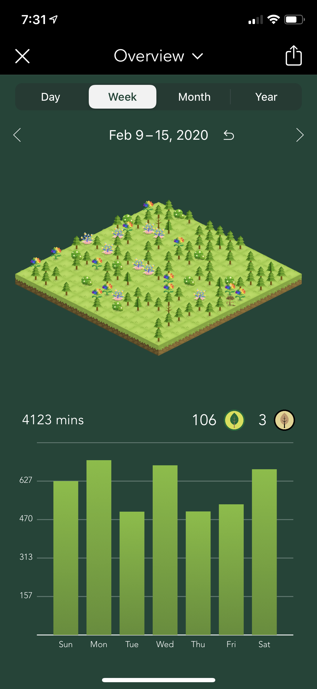
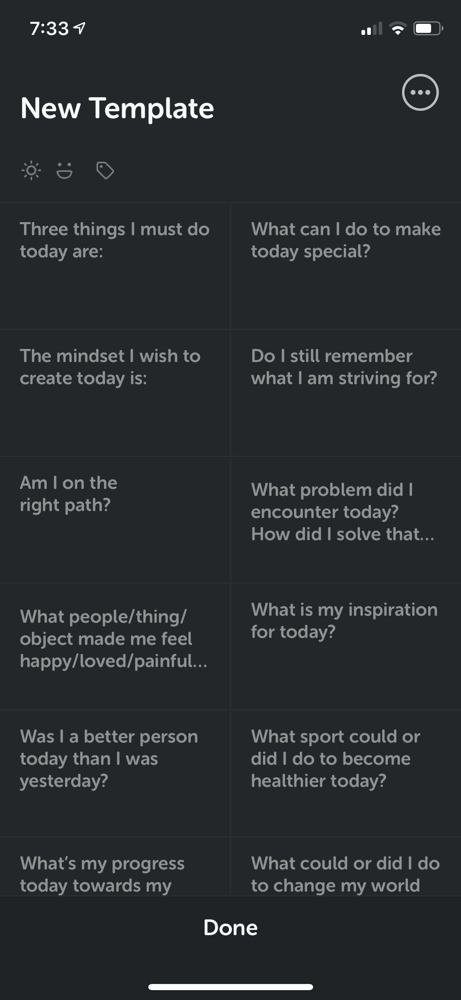

This is the first week after I decided to make some change to my life, time to take a review of the past 7days.

#### The app that I use
Personally, I understand that I am not that type of guy who could focus on something for a very long time, and I am definitely not those guys who could dedicate study for over 10 hours a day. And that is basically the reason why I always stop moving forward, cause I knew I wouldn't make it. So, I need some tools to assist me to stay focus on study, stay away from being distracted from all sort of things which are irrelevant to my study. At first, I wrote dairy to review my daily life, to make sure that I was on the right path and things that I did were appropriate. However, this way costs too much energy, and writing daily dairy becomes board soon after a few years of use. It would be great if i could develop a type of app that could record everything happens in my life along with a short description, well, I am a programmer indeed, and I know how to program iOS, Android, WeChat Mini Program, and website. Nevertheless, developing an app is too hard for my own. I cannot do it and do not have that kind of time and energy to implement it. All right, I am lazy, I admit it. 

Things changed while I was watching Youtube videos, some of the Youtubers who share their study hack tools, and I saw a few that fit my need. Though I found them a little bit late since I am already a Ph.D. student and the chance that I could get into Harvard is as rare as persuading my father to quit smoking but better than never, my life is still on the way.

The first app is the Forest, an app in which you can set up a time block and during that period using you phone is not allowed, with time goes by, a small tree will be growing up, if you use your phone, your cute little tree will die immediately, a heartbreaking moment, if you don't want your tree to die, keep study then.

]

In the last week, I stay focused for 4123 minutes, around 10 hours per day. It is not very high, but already better comparing to myself of the past. 

Another app that I have to mention is Grid Diary. This app is a diary app. But unlike our traditional way of writing a diary directly, it asks questions every day, you answer the questions, you finish your diary and record your day. More awesomely, you can set the questions yourself. Bellow is mine.

]

As to Bullet Journal, I haven't tried, will try it later.

#### The mindset that I build
A few of them come from the books that I read, but due to my bad reading habit, I didn't take notes, so I could not recall which phrase from which book. But anyway, no matter where they originated, not they are mine.

- Never wait for the right mood to start; you will never get the best mood; it is just an excuse your mind uses to escape studying.

- Never compare with others, you are the only one who stops you from being great, and you are the only one who cares about whether you are great.

- You are not defined by the judgment from others, as flowers are beautiful not because of the person who likes or hates it, stay on your own pace and keep moving.

- Never judge others either, cause you know them no better than you know when your girlfriend is gonna be angry, even if you do, you shouldn't.

- Never be afraid to try, I mean, legally. The best thing you can get is a success, and the medium result is a failure, the worst is you never try.

- The *most importantly* **Everything around you is your environment, blaming will never change anything, if you are poor, blaming for being poor will not make you rich. The only way to change your condition is by accepting everything around you as your environment and stop blaming, but facing, challenging and changing.**

- The list goes on and on, but I could not remember them right now. 

#### The books that I read

I have kept reading for a very long time; the only problem is that i have never really read in such a tense pace. I used to read only when I had nothing to do, or the situation is not suitable for doing my study work. However, while I watched a Youtuber from China whose name is Alina, she recommended 5 books to her audiences, and a few days later, another Youtuber from Cambridge University shared his experience of reading 2 books per week, and I was like, WHAT??!!. Then i decided to have a try, and I read 3 books a week, and my English skills improved dramatically(Still not good enough though). This is crazy, and since then, I've made up my mind to keep reading. Currently, I get up at 6 am (5 am maybe in the future), then I read for 90 minutes.

#### The paper that I read

I thought about reading a paper every day since last year, but I have never really applied it since I hadn'd managed to arrange my time and my life, I don't know when should I read it, and whether I could make it or not, therefore, I just stopped doing. Until my labmate, Saeid mentioned how many papers I read per day. One paper every day, I said, and I the meantime, I decided to read one paper in the morning every day without any hesitation. I am going to use the power of habit to force my mind and body to change. Being the master of everything within this human frame, I have to learn to command it. After that, I have read 2 papers and built the mindmap for them. To push myself, I only give myself 90 minutes to finish the paper.

#### The daily routine
Time is so precious, but if we don't make a proper plan to manage our time, most likely, we will be like kind of lost somewhere and don't know what to do even though we actually have a lot of tasks in the queue. Therefore, I decided to fix my daily routine to assign some time for specific tasks. Currently, I get up at 6 am, and after that, I read for 90 minutes and followed by another 90 minutes of reading paper. And I go to the lab at around 9:30 am, and the time between 9:30 - 11:30 will be a whole-time block, anything I want to do(Homework, preparing exam, or doing exam) must happen as a whole, which is a 2 hours time block.

Moreover, I go to the dining hall after 11:30 am, and set a 30 minutes time block on Forest to finish my lunch the moment i enter the dining hall. With out managing my time, eating lunch could cost me 1-1.5 hour(s). 

After the meal, I will have 30 minutes of reading time and another 30 minutes of resting time. 

Time on the afternoon will be split into single hours, and each hour could be assigned separately or consecutively to tasks. During each hour block, only one thing should be focused on.

I go to the gym at around 4:30-5:00 pm, and running for around 30 minutes there(will be longer in the coming future.). Another rest period comes after the gym, and I have to go back to work at least at 7:00 pm and work till 9:00 pm.

Sleep time is set to 11:00 pm, before that, I could read, and do anything I want.