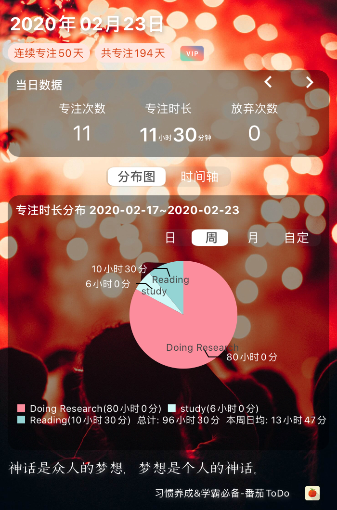
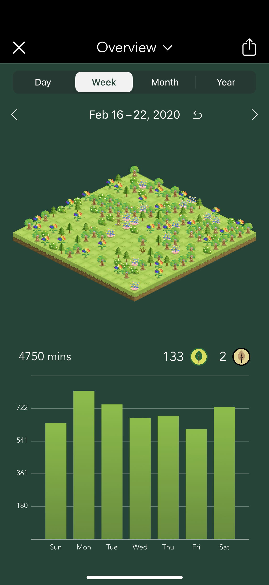

I don't remember when is the exact date that I started to record and manage my daily time, I used to write dairy, dairy only to myself, and then I began to write letters to friends of mine, not a single letter, but notes as a series to the best friends of mine, with the content in the form of talking with them about my experience, my feelings, and my understanding about this world. I might be that kind of guy who doesn't really like the feeling of chatting face to face, just telling instead. One of the reason that I believe is that I prefer to think a lot of strange things that others usually won't care about, like what defines us, our body or our soul, if it is our body, which one is us once our body is split by half, and could I feel the feeling of the guy who is a perfect copy of myself? This kind of thing is not likely to have an answer to it, and i know it clearly that my friends are by no chance will be interested in it. So, i just chose to share them with friends and expect no response. 

From a very young age, maybe 10 or 12, I started to think about this world, I felt that everything in this world was fake except me because I could only sense my feeling, all the others around me including my mom and father might just be the imagination of my brain. I must be exceptional to be present on earth. Later on, I started to feel others' pains, others joys and sorrows, so ordinary as I am. But something new pops into my mind, what is this world, if everything is real, then, what it is, what is life, what is the relationship between friends, father and son, mother and daughter, and what is love between couples, and what is the difference between those relationships. I thought about those for a very long time. Until now, I still got no clear answer, but at least it won't influence me as they did many years ago. My girlfriend, if you see this occasionally, I do love you with my life. I sware.

Well, anyway, to better understand this world and in the meantime to understand myself, I started recording my life from a very young age, and now  I just find something more convenient, which is the "Bullet Journal." The first time I know, this was when I was watching a Chinese Youtuber who was sharing her experience to make her own Bullet Journal, but back then, I had no idea what she was doing. The actual reason that I subscribed to her was that she also shares her study tips and recommends books that she reads. And after a while, I also find that another Youtuber also recommended this journal method, and I started to search more on this. However, this journal method needs handwriting all the kinds of stuff on a dotted notebook, including the name, the calendar, and the outline, which I could not accept as a lazy dog.

So I just gave up the idea of using this method immediately. However, as time went by, more and more Youtubers and even some articles slipped into my eyes, all of them highly recommend this method, and my curiosity ignited again. I searched for a well and found an article showing how to make Bullet Journal through the Bear note app. Well, I also heard about the Bear for a long time, so i decided to have a try. 

And here I am, a new Bullet journal believer.

With my bullet journal, I set up the goal of my year, and then assign those goals to a specific month, then, assign them to each week of that month, and lastly, I fill my daily routine to finish those goals, in this way, I make a general year goal into a progressive task that is undergoing through each specific day. And my whole year becomes under control immediately. 

Bellow is my daily routine and some fixed tasks:

##### Daily Routine Template
##### Task List
- Daily morning book reading
- Daily night book reading
- Daily paper reading
- Daily fitness

##### Daily Routine
- 6:00 am -> Get up
- 6:00 am -> 6:55 am Read Book *[]*
- 6:55 am -> 7:05 am Rest / Fill today’s routine
- 7:05 am -> 7:55 Read paper. *[]*
- 7:55 am -> 8:15 am Prepare to go to the Lab
- 8:30 am -> 9:25 am *[]*
- 9:25 am -> 9:30 am Rest
- 9:30 am -> 10:25 am *[]*
- 10:25 am -> 10:30 am Rest
- 10:30 am -> 11:25 am *[]*
- 11:30 am -> 1:00 pm Lunch Break
- 1:00 pm -> 1:55 pm *[]*
- 1:55 pm -> 2:00 pm Rest
- 2:00 pm -> 2:55 pm *[]*
- 2:55 pm -> 3:00 pm Rest
- 3:00 pm -> 3:55 pm *[]*
- 3:55 pm -> 4:00 pm Rest
- 4:00 pm -> 4:45 pm*[]*
- 4:45 pm -> 7:00 pm Afternoon Break/ Class
- 7:00pm -> 9:00 pm*[]*
- 9:00 pm -> 9:30 pm Prepare to go back to UT
- 9:30 pm -> ~10:30 pm *[Phone Call]*
- ~10:00 pm  -> 11:00 pm Reading book *[]*
- 11:00 pm -> 6:00 am Sleep

##### Event List

#Routine 

Each day, I will have a general task list that records the tasks that are supposed to be finished, followed by the detailed routine of the day, jobs in the task list will be assigned into the time block of the routine, and will be strictly followed through the day. The event module will record the things that happen during the day in brief words.

## What I studied in the past week

The good part of the past week was that I followed my daily routine to get up at 6:00 am every single day and read books and papers in the morning. However, i found that 1 hour or 90 minutes is far from enough to finish an essay, hence I shrank the time for reading a book and assigned 2 hours for paper reading. I could read at all of the trash time of the daytime anyway.

In the past week, I traced around 14 hours of behavior each day, it does not mean that I studied 14 hours each day, which is impossible, it merely means that I was monitoring the skipping of time, and I know that one after another hour has passed.

]

And the Forest shows that I stayed 13.3 hours focus on the tasks that I was doing in the past seven days on average, which i think is not bad. However, the hidden part of this is that I didn't follow my daily plan that strict except for the routine in the morning and night, I planned to finish reading the Sprints paper and also planned to complete the SEV communication task, all failed, though I studied something else instead of having fun, it is still not right. I need to improve myself. 

]