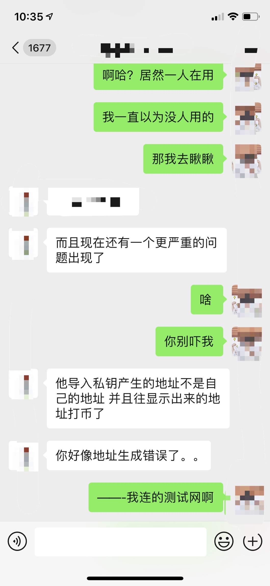
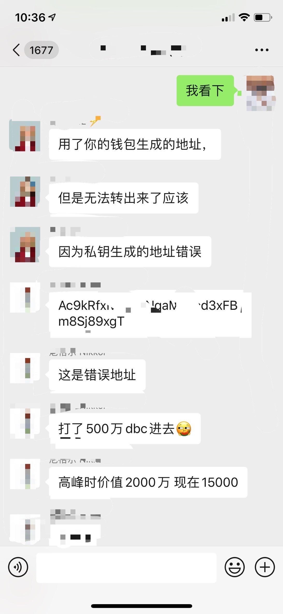
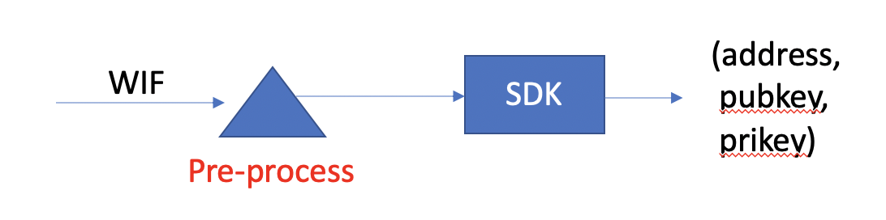

## 前言

我本来做了一个很幸福的梦，直到被闹钟吵醒。

## 背景

2017年年初我在微信小程序刚发布的时候就开始跟踪小程序的开发，感觉是个很好的傍身技能，算是最早搞小程序开发的一批人。2017年年中的时候因为帮助朋友毕设做区块链而第一次了解区块链，并在2018年年初开始跟踪国内比较厉害的区块链项目Neo，彼时出发点是国产区块链，技术交流比较方便。在大致了解Neo技术之后有了给Neo开发一款微信小程序钱包的想法，后来NEL社区直到我在做这件事之后就开始给我提供技术支持。

为了在微信小程序平台实现一系列的加密算法，我把NEL的ts-sdk一通爆改并最终成功把ts-sdk迁移到小程序平台，这也算是小程序钱包的核心了。之后就是页面设计，实现，交易测试等等。为了避免微信平台禁止我上线，我还特地只把钱包链接在测试网，把小程序钱包定义为一个区块链开发辅助工具，而不是一个转账支付平台。


## 尘封的小程序

我由于科研原因，精力所限无奈停止更新，最后一个版本也是在8个月前做的更新了，尤其是当时其实还没有完全完成开发，代码里还有很多测试代码。8个月的时间，足够改变很多事了，比如我当时用作服务器的一台设备现在也造就停机，所以小程序有些功能其实已经不能用了。

但是由于是提交在微信小程序平台，所以平时偶尔搜索一下钱包，还是可以维持小程序的继续存在而不至于被微信给注销掉，如此风平浪静过去数月。

## 比病毒还刺激的消息

我平时是晚上11点睡觉，第二天5:30 或者6:00 起床，因为早起的话到处都比较安静，适合看看书看看论文。但是今天就比较不一样了，我一睁眼，看了眼手表，就看到Neo的尼格尔给我发了消息，诶？我很好奇就点开看了下，说是有人对小程序的反馈，还发了个文档给我。我就更好奇了，这都猴年马月了，怎么有人想起来给小程序搞测试了？于是就想看看具体是哈问题。但是我刚给尼格尔回信息，他就给了我另一个更加让我惊讶的消息，人家不仅用了，还发现了bug。最刺激的是，在发现bug之前往由小程序生成的账户理转了账，而那个账户的地址算错了。我当时也没当回事，我这测试网呢，怕啥。然后尼格尔就跟我说人家在主网往这个bug了的地址转的帐，现在搞不出来了，说我在诈骗。我当时就懵了，还能这样？
<div>


</div>
看看这个数字，动不动几百万啊！！，几百万啊！！我当时就慌了，赶紧查了查自己的银行账户，三位数，然后回头就赶紧跟我女朋友发消息让她放心，我会偷电动车养她的。

## 生活已是如此艰难

最近疫情肆虐，本来已经很慌了，更遑论川建国还在到处 “中国病毒🦠“搞种族对立，出门都怕被按在地上搓，奈何科研设备又在实验室必须出门。还要担心经济大萧条，到时候一堆无业人员到处跑难免出现动乱。现在又出这个事情，简直心态要绷，看到2000万就感觉心跳加速要删微信。再冷静下来一看，居然已经跌到15000，感谢币圈暴跌，但这也搞不定啊，心中默算要多少年才能还清，能不能等两年币价归零了再赔人家。但无论怎样，还要最后挣扎，看看能不能把人家资产找回来，虽然我知道小程序问题很多，但是我对于自己亲手捣鼓出来的小程序SDK还是很有信心的，毕竟那个SDK花了我半年时间反复测试，一个function一个function的跑，一个字节一个字节的对照，应该不会出问题，所以我对于反向计算私钥还是有点底气的，只要不是椭圆曲线计算的问题，一切都理论上可以搞定。

<div>


</div>

## 问题分析

为了复现问题，我重新下载了小程序IDE，还重新安装了wepy，一阵忙碌之后才又终于把小程序跑起来（哥们发现bug账户之后就把我小程序投诉下架了，我连看都没得看）。

根据问题描述，我推断是账户导入的时候在计算用户账号的时候出了问题，可能是我写了测试代码，对方用了我的测试账户，也可能是某些判断条件出现问题多了或者少了字节，比如对方输入的时候多了空格之类的。这样的话问题还是不大的。



如图，我推断是用户输入WIF，在预处理阶段（标红）出现问题导致后面账户解析出错误地址。所以我在追踪问题的时候就从这里入手。

## 定位问题

为了测试是否是我的代码真的有问题，我在编译了小程序后先拿一个测试账号试了一下，果然目标地址是错的，所以确实在导入账户的时候出现了问题。

```
WIF:L3tDHnEAvwnnPE4sY4oXpTvNtNhsVhbkY4gmEmWmWWf1ebJhVPVW
Address: AKW7n7qgJuKwjxUP11sSqJf9L6cpsR17d6
```
这个WIF在我的平台地址解析就和在NEL Wallet解析则是：
```
APwCdakS1NpJsiq6j9SfvkQFS9ubt347a2
```

巡着账户导入的逻辑，我最终定位到问题是在对WIF格式进行判断的时候出现了问题：

```
let privateKey;
if (key !== null && key.length === 52 && key.charAt(0) === 'K'){
    privateKey = Helper.hexToBytes(Wallet.wif2prikey(key));
} else {
    privateKey = Helper.hexToBytes(key);
}
```

这里我本来为了兼容WIF和私钥的导入对输入的字段进行了格式判断，结果在对WIF判断的时候是加了对首位字符判断为‘K’的逻辑，说实话，我不记得在哪里看到的，但是确实好像当时首位是必须为K的，我不知道为什么后来WIF可以为别的了。而那个bug账户的WIF就是‘L’开头的，这就导致我的判断逻辑成了智障（我现在感觉自己就是个智障）。当然，这里代码本身写的也不严谨，单纯的else过去也是导致问题的原因。

在这里我其实看到了希望，我赶紧又跑去跟我女朋友说我可以不用偷电动车了，然后我女朋友告诉我说她想在上海买房。

## 逆推私钥

这里已经很明显看到了问题，就是直接将WIF作为hex处理了，这可还行？Base58不要面子啊。但是既然是用的是吧WIF转成字节数组作为私钥的话，那我就直接把这个数组再转回来不久可以了么？

机智如我，果断测试了一下：
```
000000ea00000004000000000000000b00000e0000f1eb000000
```
嗯？这画风不对啊，这啥啊，怎么短了？怎么这么多00？不过转念一想，也对，我把WIF当成HEX，那肯定大于e的全都都直接0处理了，但是这么短怎么办？难道要填充00？这玩意大端还是小端啊？我上次仔细搞这些都已经大半年前了，现在猛然让我去想这些我还真的没有头绪，但是不管了，大端小端都试试。

最后我是在前面加了6组 00 凑够64个字符，然后再用来计算WIF：
```
KwDiBf89QgGbjH6v6hsSAkV3HNF8x6iLqjsbuzdsfu59PjxLkSsJ
```
然后用这个WIF在NEL wallet去登陆测试，终于得到了跟bug账户一样的地址。就此得到了bug过的测试账户私钥。

## 收尾

之后的话就是要来了对方的WIF，然后逆向计算出对方bug账户的合法WIF，并把WIF发给了对方。刚刚又去浏览器上搜了一下，对方已经果断把资产转走了。

作为一个开源社区开发者，虽然最后帮对方找回了私钥，但是还是感觉很抱歉，因为我项目本身的bug给对方带来这么大的惊吓，在此也表达诚挚的歉意。

之后就看看能不能把我的小程序申诉回来吧，毕竟自己一个人默默敲了这么久还更了好几版，直接没了还是蛮心疼的。

最后还是要反思一下自己对区块链相关项目的安全性考量，毕竟跟用户账户相关，每一个字节的错误都可能导致使用者的资产丢失。同时呢，也呼吁大家在开发类似项目的时候，一定要对账户生成，账户备份，账户安全等方面加倍的谨慎小心。