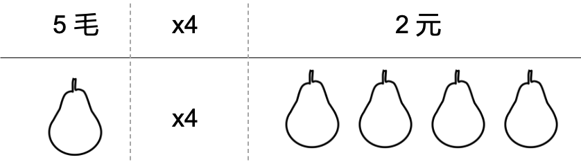

作为一个去中心化的信任解决方案，区块链的隐私问题从比特币出现的那刻起就一直伴随着区块链。这个问题的根源在于 1. 区块链是一个分布式的系统，所有的节点都可以获取所有的链上信息；2. 区块链可信基础之一的共识算法要求所有的交易都是公开的可验证的。基于以上两个原因，我们在使用区块链的时候，所有的提交到链上的信息都是完全赤裸裸的，你发送的每一笔交易，做的每一个合约调用，乃至每一个链上活动都是有迹可循的。而且由于区块链的不可篡改性，这些信息将永远被记录在案。

有些人可能会感觉说区块链上的账户都是大家自己任意创建的，跟自己在物理世界里的身份信息并没有直接的关联，即使在链上的足迹被追踪，也无法影响自己在物理世界的隐私信息。但事实却恰恰相反，因为虽然我们的区块链账户的创建过程和我们自己的身份信息是毫无关联的，但是我们在使用这个账户的时候却会或多或少跟自己的真实身份产生交互，从而使得别人可以通过你在链上的交易信息追踪到你在物理世界的真实身份。举个例子，门头沟幕后的黑客大佬就是小胖哥Kim Nilsson用了三年的时间，根据分析海量交易记录发现蛛丝马迹定位到黑客身份的。其背后原因其一是区块链交易的可溯源性，其二也是我们用户本身其实对换账户这件事是有惰性的，经常一个账户在各处使用。

## 混淆器

针对区块链的隐私问题最早的解决方案应该算是真对比特币的混淆器了（Mixer）。混淆器的原理类似于我们以前在电视上看过的，主角为了躲避跟踪于是找了一大堆和自己穿着打扮一样的人在自己周围走动从而使得跟踪者不知道哪个是自己。混淆器会接收一大堆的来自用户的输入，然后经过一系列复杂的中间账户的转移操作，之后转出给用户指定的账户，这样在用户的输入和输出之间就可能涉及到几十甚至上百个和中间账户和中间交易，极大的削弱输入账户和输出账户的关联关系，使得追踪者无法定位输入账户资产的最终流向。

混淆器结构简单，便于理解和实现，但是其问题是 1. 用户需要把资产转入混淆器，这个过程是具有风险的，混淆器一旦出错，用户的资产将无法寻回；2. 混淆器虽然可以极大的增加追踪的难度和复杂度，但是所有的交易依然是可以追踪的，在新的分析手段和算法加持下，其分析难度也逐渐下降。

## 零知识证明

出了对已有的项目进行混淆之外，更好的解决方案当然是创建一条新的完全针对于隐私保护问题的区块链。这样的区块链也是层出不穷，但是很多使用的技术都是零知识证明。零知识证明顾名思义就是在证明过程中无法获得额外的知识信息的过程。我们经常举的例子就是数独问题：我给你出一个数独的题目让你做，但是你想知道这个数独是不是真的有答案，因此我需要向你证明这个答案的存在，但是又不能告诉你这个答案的内容。因此我证明的过程就是，你任意选列或者行，我把指定的行列的9个数收集起来打乱顺序给你，你看到每个数都在就知道这行是有答案的，依次类推，你验证的行列越多，你就越相信这个答案的存在。但是在这个过程中，你是无法获得任何跟答案有关的信息的。

但是有些问题，首先，这个证明需要的验证数据量很大，起初大家用的是zk-snark，后来有了bulletproof来极大的减少这个验证的数据量，但是零知识证明的验证还是很繁琐；其次，这个生成证明的过程计算量很大，比较费时间；还有就是零知识证明需要针对每个特定的逻辑设计专门的电路，技术门槛比较高，不存在通用的电路来验证合约。

## 隐地址与环签名

这些都是使用在门罗币项目里的技术。我们目前绝大多数的区块项目如比特币，Neo，以太坊等都是账户是账户，交易是交易，账户控制交易，交易关联账户。但是门罗币就是个异类，它的隐地址技术使得你无法根据一个目标地址查询到任何与其关联的交易，因为交易跟账户压根没有任何关系，每一个交易本身都相当一个独立账户。举个例子，我们通常理解的交易是：我从我的账户给你转五毛钱，你查询接收。这个隐地址的交易模式是：我创建了一个账户在里面存了五毛，只有你的私钥能使用这个账户。

隐地址可以在交易中隐藏目标地址。源地址则使用环签名来进行隐藏，用户在发送交易的时候，会和别的用户共同构成一个环，大家共同对交易进行签名，这样在外人看来，这个交易是来自于环成员的，但是具体来自于哪一个成员则无法确定，从而隐藏了交易发送者的地址。

但是这种技术的问题也比较明显，别人无法查询你的信息，你自己也很难查询，比如你想知道哪一笔交易是发给你的，你必须对每一笔交易都用你的私钥来试一试，你不试一试，你也不知道这个交易到底是不是给你的。

## 同态加密

同态加密的技术其实主要用于智能合约，我们在前面的几乎所有的技术都是不能用在智能合约领域的，因为智能合约的逻辑是由用户编写，你无法确定它具体什么样子，所以你没办法提前给用户编写验证的电路。但是同态加密确可以在一定程度上隐藏用户的信息。

同态加密简单理解就是计算的封闭性。举个很简单的例子，五毛钱一斤梨，那我现在有四斤梨子，它一定值两块钱。意思就是钱和梨子有相互的对应关系，你可以从梨子到钱，也可以从钱到梨子。 同态加密就是，首先把数据加密，然后对加密后的数据来进行计算，计算的结果在解密之后和原数据直接计算的结果是一致的。这样就可以既保证了数据的隐私性，又保证了计算结果的正确性，从而实现了对智能合约执行过程隐私的保护。

## 可信执行环境

可信执行环境是芯片中的一处安全区域，由硬件提供最直接的安全防护，加载到可信执行环境中的数据和代码将无法被不安全的系统进程访问，从而保证了数据的隐私性。其实现在可信执行环境已经在我们日常生活中很常见，它就在你的手机里，系统无论是Android还是苹果，芯片无论是高通还是A13还是麒麟，内部都有可信执行环境来在本地保护我们的个人隐私。很多科研人员也在研究将可信执行环境来和区块链进行结合的方式。有了可信执行环境加持的区块链系统不仅可以实现隐私保护的交易处理，合约执行，甚至可以为比特币这种不支持智能合约的项目增加合约执行的额外功能。

## 侧链与通道

除了以上直接在项目本身动刀子的解决方案之外，二层解决方案也可以很好的解决区块链系统当前遇到的隐私问题。

侧链通过建立用户转有的一条链并且与主链进行铆接，只在关键的资产变动的时候才与主链进行交互，其余时间的交易信息都仅仅由侧链进行管理，不会同步到主链上，从而避免了不必要的信息泄漏。虽然侧链在理论上解决了目前区块链系统面临的问题，但是它本身却是牺牲了区块链系统的去中心化特性而存在的，侧链可以由专门的组织特地建立，这样的一条链完全是中心化的，其安全性无法保证。

通道系统目前主要是基于比特币的闪电网络，原理是用户在主链上创建一个只有两方参与的多签账户，两个参与者可以在链下任意变动这个账户中的余额分配，只需要把最后的结果提交到主链上就可以了，而在这个时间内，两个参与者可以任意发起无数次的余额变动而不需要提交任何数据到主链上，从而避免了交易信息的泄漏。不过这种结构虽然简单，但是却很不方便，用户在使用的过程中需要提前锁定一部分的资产在通道内部，此外通道系统的争端解决方案也存在着日蚀攻击的风险。

区块链隐私问题的研究方兴未艾，各种新的技术和解决方案层出不穷，相信终有一天，一个完善的解决方案会将其完美攻克。