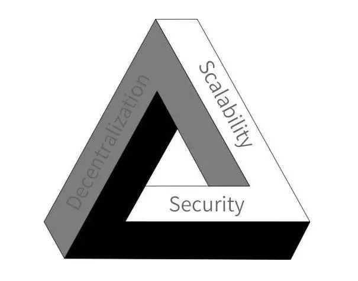

---
title: 优质项目引擎：不可能三角
date: "2020-07-19"
<!-- featuredImage: './book.jpg' -->
---

自从中本聪大神在2008年提出比特币的想法并在2009年发布比特币以来，各种基于区块链的代币项目如雨后春笋般出现。经过十年时间的沉淀，现在市面上还活跃的区块链项目也有数千种，已经死掉的项目更是不计其数。由于加密货币的旁氏属性，绝大多数的加密货币项目都是毫无意义，画蛇添足，甚至单纯用来诈骗的。但是在洗去泡沫和浮躁之后，在穿透区块链市场层层迷雾之后，我们还是可以在这个市场的混沌之下，看到背后隐藏的发展脉络。这个脉络指导者主流的区块链项目的发展方向，也是区块链之所以可以在种种声讨加密数字货币的声音中依然有主权国家级别的机构愿意为这个技术背书的原因。首先在循着脉络去深究的过程中，本文会涉及到一些加密货币项目，但是本文完全从技术角度来看待各个项目，文中观点完全不能作为读者投资的建议。

当然，当前加密货币领域的优秀项目已经不完全是针对于区块链技术本身，因此我将现今的区块链的发展项目分为两类，一类是针对于区块链本身的项目（包含智能合约），我称为区块链项目，例如比特币，以太坊，Neo等；另一类是服务于区块链的项目，我称之为服务性项目，比如ChainLink，IPFS，Tether以及各个交易所推出的服务于自己的项目等。我在本文主要分析区块链项目。而我所谓的隐藏在众多区块链项目背后的脉络，便是区块链本身的三大属性：安全性，可扩展性和去中心化，也就是所谓的区块链不可能三角。不可能三角的意思是在区块链项目中我们没办法同时兼顾区块链的安全性，可扩展性和去中心化，只能在三者间来做取舍，最多也只能做到两者。

区块链不可能三角

我们都知道比特币之所以为大家所接受最开始就是因为其去中心化的特性，在最开始比特币还没有什么价值的时候，便以其去中心化货币的概念吸引了一大批拥趸。大家都听说过早期的比特币，基本是作为一种游戏币存在的，数万的币随便送人，有些网站直接给访问者送比特币以吸引流量。比特币的迷人之处便是这种完全去中心化的创举，但是相应的代价便是其漫长的交易确认时间，以及随着时间日益降低的可扩展性。早期笔记本就可以挖掘比特币，很多人抱着好奇的心态在自己的宿舍里挖比特币，然后把电脑扔了，后悔终生。现在十余年过去，挖掘比特币已经只能靠最先进的矿机来进行，甚至需要7nm甚至5nm这样制程的芯片才有利可图。除了智能合约，以太坊在区块链技术本身其实没有特别大的进步，虽然确认时间缩短到了15秒左右，但是这并不是因为技术进步，而只是一种源码层面的修改。数据存储也是区块链项目可扩展性差的原因之一，现在比特币链的大小已经达到了数百GB，给新节点同步数据造成很大的负担。

当然，针对于区块链项目的可扩展性问题也是有人提出了各种各样的解决方案。针对比特币这种算力证明的共识算法，各种各样的共识算法也是层出不穷，比如Neo的dBFT，EOS的BFT-DPOS是通过牺牲去中心化特性来解决可扩展性问题；Cardano以及以太坊2.0要迁移的共识算法POS则是通过牺牲安全性来解决算力问题（POS相对POW安全）。比特币、比特币太子BCH以及比特币太孙BSV根本上则是围绕着交易效率而作的各种不同技术选择。

当然除了一些基于已有项目来做性能提升的项目之外，也有死磕不可能三角某一角或两角的。比如Zcash和门罗币则是专心的死磕安全性，在安全这条路上一直走到极致，但是相应的代价则是这两个项目在执行交易的时候计算量很大，可拓展性也是一塌糊涂。尤其是门罗币，你去门罗币的浏览器搜索栏看一下就会发现，这个搜索栏都没办法查询地址，也就是说你想知道自己的余额都需要自己同步整个链来在本地处理数据。在安全上死磕的项目还有一个不太出名的SERO，主要是用同态加密做智能合约的安全。Neo目前来看是死磕可扩展性的一个项目，无论是3.0中的RootState，分布式文件系统还是更短的共识周期，看起来都是在死磕可扩展性这个方面。也有死磕去中心化的项目，比如IOTA，这个项目直接干掉区块链的链式结构转而实用有向五环图的数据结构来组织数据。在推出之后也是因为其独树一帜的结构而风行一时。

区块链的不可能三角虽然理论上无法突破只能取舍，但是依然有人在尝试用一些取巧的方式来一定程度上做到某种突破。比如大名鼎鼎的Algorand，把随机选取节点的方式引入共识，进而突破所谓的不可能三角，这个idea来自于MIT，发在了计算机顶会SOSP，当时是引起了学术界的一阵骚动，甚至给这个项目配套的辅助算法都曾经也发过顶会。此外，也有链下解决方案，比如状态通道，代表项目是Celer，还有侧链，代表项目是Plasma，不过已经凉了。

当然，我这里分析的都是公链项目，推动区块链技术进步的还有联盟链和私链技术，包括蚂蚁和腾讯这样的大长也在为区块链技术的进步贡献者重要的力量。但是归根结底，区块链技术的进步，优质项目的产生，始终是围绕着这个不可能三角在盘旋。