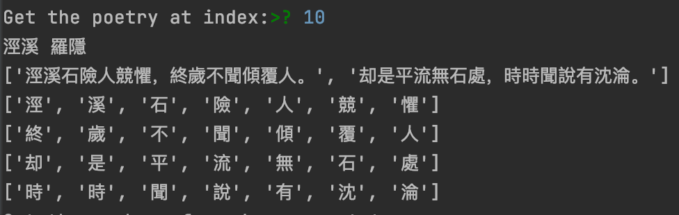
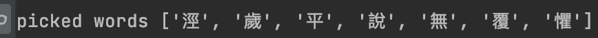
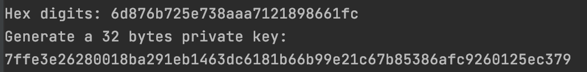
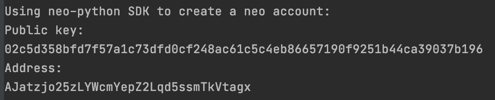

Property: Blog, Neo

## 是你的币，不是你的币

> 2020年2月21日，爱尔兰的柯林斯将自己的加密货币账户打印出来上并藏在鱼竿盒里。后来这个鱼竿盒被当作垃圾扔到了垃圾填埋场。而这些加密货币的总价值是5900万美元。2013年，一位英国工程师豪威尔在家大扫除时，将存有7500枚比特币钱包密码的硬盘丢到了垃圾桶里。2010年，席尔•特纳在挖出了两枚比特币之后，便把自己的电脑放到了阁楼上。当席尔再次想起自己的比特币时，他的旧电脑已经因为长时间的存放而不能使用。

我们在讲加密货币的时候总是喜欢提起它的去中心化和高效率，并且总是畅想着区块链技术在各行各业里落地，走向普罗大众的生活，而不仅仅是中心化交易所里虚幻的数字或者大学校园里教授和博士研究的课题。但是我们往往忽略了一个很重要的问题，那就是私钥问题，好吧，我承认这个问题并没有被忽略，只是暂时还没有很好的解决方案，但相信我，私钥丢失问题远远比我们想的要严重。毕竟在一个去中心化的系统里，每个用户单独掌控自己的账户，拥有对账户的绝对控制权，而这一切都依赖于并且仅仅依赖于用户手里持有的那个跟账户对应的私钥，一个完全不能泄漏，完全不能丢失的一串数字。

承认吧，在私钥问题解决之前，加密货币基本不可能被普罗大众所接受。想象一下，我们的生活建立在加密货币的基础上，我们所有的资产、贸易、购物全部用加密货币结算，那就意味着我们的身家都压在区区私钥上，一个我们每天都要用，但又非常敏感的东西，是你的话，你会不会害怕。

如果我们遗忘了银行账户，我们可以很轻易的给银行打电话，一个声音甜美的女声会在确认你的身份之后温柔的告诉你你的账户信息，这很快，而且不需要花任何钱。但是如果你的私钥丢了，你将投诉无门，因为除你之外没有人掌握你的账户信息，你是唯一直接责任人。换句话说，你如果丢了自己所有的私钥，那么你的奋斗将化为乌有。所以，区块链上的，是私钥的币，不是你的币。

## 助记词，纸质钱包以及硬件钱包

为了解决私钥问题，无论是研究区块链的还是玩加密货币的都为此投入了很多的精力，想出了很多的方法来帮助用户管理自己的私钥。

助记词是一个比较好的方法，毕竟私钥本身是一大长串无规律的字符串，记忆起来难度可想而知，对于没有学习过记忆宫殿之类记忆方法的人来说，想要记住私钥并且长时间不忘记，那几乎是不可能完成的任务。而助记词则是把私钥重新映射到有具体意义的英文单词上，让用户通过记忆一组有意义的单词来保存自己的私钥，毕竟英文单词首先是容易记忆，其次不容易出错。但是很遗憾，这么优秀的私钥解决方案对于英文比较好的人词汇量大的人应该是问题不大，但是对于英语不好的人来说，，，记忆英文单词并且不忘记恐怕跟记忆随机的字符串没什么太大的区别。作为一个雅思GRE都准备过的人，我面对助记词里的英文单词的时候，也是一个头两个大，很多都完全没见过，所以我至今处理助记词和处理私钥都是一套流程——抄下来，怎么抄的私钥我怎么抄助记词。记是不可能记得住的。

纸质钱包就是我上面说的“抄”下来了。获取纸质钱包的方式有很多，最简单的当然就是自己动手抄，这个要求你自己起码要认识自己写的是什么，如果你书法造诣清奇，你甚至可以写的别人完全认不出来，相当于手动加密保护，比如我小学时候的作业，完全只有自己认识。你也可以通过一些线上钱包创建账户，然后下载他们给你生成好的钱包，比如 

[Blockchain Explorer](https://neotracker.io/)

在这里你生成账户之后可以下载他们给你的pdf版本的钱包，自己再打印出来，这种钱包的好处是不仅有文字版本的账户信息，还有对应的二维码，二维码内置的有冗余纠错码，所以你完全不用担心账户信息会出错。以下纸质钱包是我新创建的样例账户，请不要往这个账户地址转钱。


但是纸质钱包的问题也很明显，你要一直保护着这个钱包，要藏起来不让别人看见，也不能做太多备份，不然如果你忘了某一个备份结果让别人得到了，那你的钱就没有了。所以纸质钱包虽然让你对资产拥有了更强的掌控能力，但是却也更加有风险，如果你是用的纸质钱包，确保不要备份很多份，确保不要忘记把钱包藏好，确保不要当垃圾处理掉。

至于硬件钱包则是我不很愿意提起的一个钱包方式，倒不是说不信任或者感觉方法不好之类的。硬件钱包当然是一种很优秀的解决方案，它能帮助你痛死抵御来自硬件和软件层面的安全攻击，可以说是目前为止私钥保护最安全的方案之一。但是我总感觉硬件钱包本身是不能独立使用的，你必须有相应的纸质钱包作为后盾，不然如果你私钥仅仅在硬件钱包里，那你一不小心一屁股把钱包坐碎了怎么办。

除了以上的方案之外其实还有人在研究丢失私钥后的找回问题，大概思路就是另外建一个侧链来专门管理用户的账户，用户把可以找回自己账户的信息分散的存储在各个去中心化的节点上，大体如此。

## 你还记得诗词么

接下来我讲讲我新设计的一套账户私钥管理方式。我设计的目标是让私钥方便记忆，甚至不需要记忆，并且任何时候可以轻松找回。

其实想让一件事便于记忆的最好方式就是把文字信息转化为图画信息，因为人的大脑结构特殊性，人记忆图片比记忆文字的能力要强上几千上万倍，一张图片在你眼前展示10秒，你可能几个月后再看这个图片依然感觉熟悉，但是如果给你一篇文字让你看十秒，那估计下午上个厕所的功夫就忘的差不多了。所以用画面替换文字是我一直思考私钥管理方式的一个大方向。

但是图片本身又是富信息的，你把图片压缩一半，图还是那个图，你把图片几个像素抠掉，图几乎没有任何变化，所以怎么把图片用来存储和展示私钥信息是一大难点，图片太容易被隐秘的修改了，别的不说，隐写技术都发展成一门安全手艺了，学安全这么多年我傻了才敢直接用图片本来的信息去表达私钥。所以我想来想去，还是不能直接用图片，而是用一种具有画面感或者故事性的东西来作为私钥的载体，于是我就想到了古诗词，【晨兴理荒秽，带月荷锄归】，是不是感觉很熟悉，铺面而来的画面感，哪怕高考过去这么多年，依然那么熟悉。

所以是不是可以用诗词来表达私钥呢，方法就是把诗词作为生成私钥的种子来创建账户。这样的话不就满足了方便甚至不需要记忆私钥的目的了么，而且还有画面感，绝对难忘记。

但是啊，但是，古诗词就那么多，全唐诗才5万，整个古诗词加一起才一百万左右，这私钥空间太小了，真那这个生成私钥，按照现在处理器的速度，都不用上显卡，整个加密社区肯定秒秒钟被彻底攻陷。所以还不能直接用诗词。

接下来我就在考虑私钥空间这件事，我们知道现在的neo私钥是32个字节的，也就是256位，所以我要是想弄出来一个安全的私钥表达方式，那种子空间也不能少于2^256，否则这个方式肯定就是不安全的了。鉴于此，我就先看看诗这个东西。下面是罗隐的七言绝句《涇溪》：

> 涇溪石險人競懼，
終歲不聞傾覆人。
却是平流無石處，
時時聞說有沈淪。

全文四句28个字，如果直接把整首诗作为一个种子，那肯定是只能生成一个账户，但是如果我不呢？是不是可以只取其中的一部分字来作为种子呢？所以我大概又分析了下，假如我只是考虑28个字的可能选择，诗里的每一个字都可以随便重复，那当取样的长度超过54的时候就可以满足私钥的安全需求，google一下（2^256)/(28^54) = 0.08263141646，这不就拨云见日了么。更别说七言律大于28个字的更是多了去了，比如有“古今第一律诗”之称的杜甫的《登高》就有56个字。

## 私钥空间

本段主要讲讲为什么会突然有28^54的私钥空间。想到这个其实也是受到以前手机上经常用的手势密码的启发，由于我一直想着图像化，图像化，于是数字和图像的完美解决方案手势密码就从我脑子里冒出来了。对啊，诗也可以作为手势密码的码盘啊，我们完全可以把诗作为一个二维的幕布，在上面画出图案，然后把图案下的字用作私钥的种子。你甚至不需要会背这首诗，只要知道名字和作者就行。接下来我简单介绍几种可以选择的取字规则，虽然取字多于54个最好，但是此处只是演示，不对取样字数做限制。

比如我们画一个V，那么覆盖的字就是【涇，歲，平，說，無，覆，懼】，由于我们可以自己定义规则，我们还可以把这个结果double一下【涇，歲，平，說，無，覆，懼，涇，歲，平，說，無，覆，懼】，这都无所谓，完全不会增加记忆成本，一个V而已。

或者我们取首列和最后一列，那么种子就是【涇 ，終 ，却 ，時，懼，人，處，淪】，我们还可以逆向一下，【淪，處，人，懼，時，却，終，涇】。这都可以，尤其是种子的长度是没有限制的，所以54只是一种可能的种子长度。

也或者我们每隔一个字取一个字，可以得到【涇，石，人，懼，歲，聞，覆，却，平，無，處，時，說，沈】。各种规则按自己喜好来定，

这样，我们就把复杂的文字信息的记忆问题，变成了一个诗的题目记忆，和一个简单的图形记忆。


## 你有一个故事，账户是古诗。

为了验证这个猜想，我用python实现了简单的流程，首先是在网上找到了古诗词的数据库，在github上搜索chinese-poetry就可以找到，里面收录了5.5 万首唐诗、26 万首宋诗、2.1 万首宋词以及其他古籍。

首先是调用json库加载古诗词信息，然后随机选一首古诗：

```python
with open('data.json') as poetry:
    data = json.load(poetry)
    index = int(input('Get the poetry at index:'))
    p = data[index]
    print(p['title'], p['author'])
    lines = p['paragraphs']
```



然后选定自己指定的图形会覆盖的文字：

```python
num = int(input('Get the number of words you want to use:'))
    picked = []
    for i in range(num):
        print('Location:')
        x, y = map(int, input().split())
        picked.append(matr[x][y])
```



然后对选定的数字进行处理，然后用hashlib库中的sha256函数把种子文字生成32字节的字符串：

```python
st = ' '.join(map(str, picked)).encode('unicode_escape').decode("utf-8").replace("\\u", "").replace(" ", "")
    print('Hex digits:', st)

    print('Generate a 32 bytes private key:')
    sha_h = hashlib.sha256(st.encode('utf-8')).hexdigest()
    print(sha_h)
```



为了生成neo的账户，我安装了CityOfZion的neo-pyhton的库，主要是用其中的python SDK，在此感谢CityOfZion团队开发出的折麽好用的neo SDK，帮我节省了大量的时间。但是也吐槽一下他们，这么好的SDK，愣是没有接口文档，给的文档很详细的介绍了怎么用那个终端，但是没有调用SDK的资料，所以我也只能去他们源码里找账户相关的接口，归功于他们优秀的代码风格，整个项目结构清晰，找接口并没有花很久。

生成neo账户的部分我导入了SDK中的UserWallet类：

```python
from neo.Implementations.Wallets.peewee.UserWallet import UserWallet
from neo.Wallets.utils import to_aes_key

print('Using neo-python SDK to create a neo account:')
    wallet = UserWallet.Create('fakepath', to_aes_key('awesomepassword'))

    keypair = wallet.CreateKey(bytearray.fromhex(sha_h))
    key_out = keypair.PublicKey.encode_point(True).decode('utf-8')
    addr_out = keypair.GetAddress()
    print('Public key:')
    print(key_out)
    print('Address:')
    print(addr_out)
```



然后我们再拿这个结果去neotracker去验证下


所以验证成功。

当然，这方法也有其弊端，比如一般人肯定喜欢选用那些耳熟能详的诗词，这样的诗词也很容易被别人利用，所以需要鼓励实用生僻的诗词，比如乾隆一生写了三万首，从里面随便拿出来一首，都肯定生僻的不能再生僻了，或者生僻的古籍的句子也未尝不可。