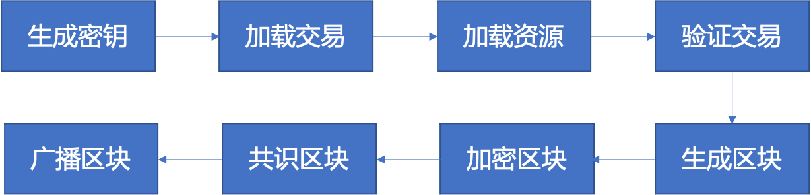
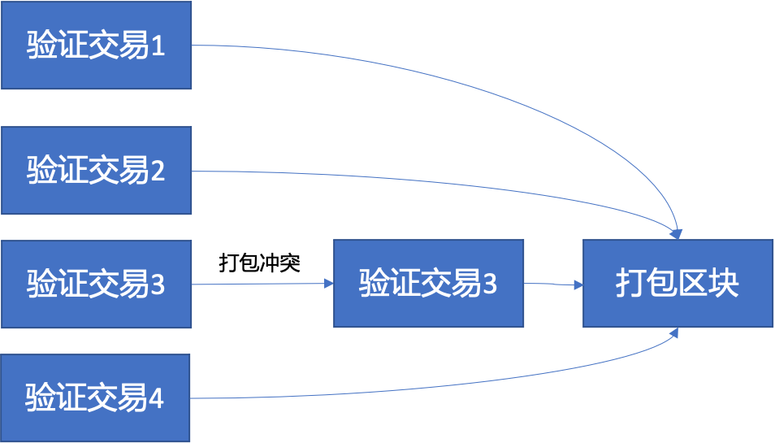

Property: Neo, Research

我在之前的很多文章里提到了一些把neo和可信之行环境（TEE）相结合的应用场景，比如安全随机数算法，但都只是兴之所至泛泛而谈。但是深入研究之后，愈加发现其实将可信之行环境引入neo的共识之内，除了可以完善一些功能之外，在某种程度上可以说甚至是一种必须。

首先再介绍下可信之行环境，也就是TEE。TEE是现在芯片领域里非常流行的一种基于芯片硬件本身的安全机制，几乎所有的处理器里都有自己的TEE。比如英特尔里有SGX，AMD里有SEV，我们手机里的ARM芯片里有TrustZone，ARMv9里也刚刚引入了CCA（一种类似SGX的机制）。对于TEE本身工作的原理大家不需要了解很多，需要知道的就是如果把我们的代码和数据加载到TEE里面，那么你系统的任何非TEE的部分都没办法知道TEE里发生了什么，也没办法读取到TEE里面的数据。类似于我们的保险箱，如果你把一只闹钟锁在保险箱里并把钥匙丢掉，那么闹钟将一直按照提前设定好的规则运行，再没有人可以更改里面的时间，没办法设置新的闹铃。

了解了TEE。我们再看现在的neo （后文称N3）。N3使用的是dbft2.0 （后文称dbft）共识算法，就是一群已知身份的共识节点轮流生成新的区块，有点像是东盟的轮值主席国机制，或者华为的轮值总裁，有资格的人轮流来，都有机会。这种共识机制的好处是效率很高，理论上只要节点硬件设备给力，tps甚至可以飙到万为单位，并且新区块具有终局性，并且不会像比特币那样产生分叉。但是这种机制也有个很明显的缺点，那就是可预测性，由于是轮流来的，下一个生成区块的节点大家都心知肚明，尤其是节点本身，也知道下一个是自己要生成新的区块，如果不出现意外情况，那么甚至往后几个甚至十几个区块的生成者也都是可预测的。这种可预测性给了区块生成者很大的灵活性，这种灵活性加上节点本身对新区块里交易的决定权赋予了共识节点巨大的能量。

共识节点在生成新区块的时候都能做那些事呢？第一是决定交易的顺序，交易顺序由共识节点决定，如果同一个区块里有两笔交易的顺序会导致交易结果的不同，那么共识节点就可以通过调整交易顺序来给出不同的执行结果。第二是交易的存在与否，由于生成区块的共识节点将先于全网络任何人先知道交易的执行结果，那么共识节点就可以在结果不符合自己利益的时候把交易剔除出新的区块。第三是临时构造交易，比如说某些合约的执行，假如刚好当前区块的时候会得出结果，那么共识节点就可以临时生成一笔最利于自己的交易打包进新区块从而获得最大收益。  虽然这些问题在pow共识里也存在，但是由于dbft本身的相对中心化而更加突出，因为pow里的节点不知道自己什么时候可以生成新区块，而dbft节点则可以提前准备。（以上均为技术分析，完全不代表笔者认为共识节点做过任何类似行为。如有冒犯，万请原谅。）

而要想解决这些问题，我们就必须想办法去限制共识节点的权限，让他们在完成共识的同时，没办法利用规则漏洞获取奖励以外的收益。经笔者分析，核心问题就在于让共识节点在验证交易和生成新区块的时候，没办法知道最终的`交易结果`，也没办法知道交易的`执行顺序`。而由于没办法知道交易的执行结果和执行顺序，那么共识节点也就没办法实现上文提到的三件事。

思来想去，能做到在实现功能的同时又保护交易结果和执行顺序不泄漏给共识节点的，就是TEE了。具体来说，就是我们把N3的虚拟机加载进TEE里，在TEE里执行交易。在每一轮共识的时候，共识节点之间协商出一个加密密钥，然后在TEE里对已经执行完并打包好的新区块进行加密并广播给别的共识节点，别的共识节点把加密后的区块加载进TEE，并用相同的密钥在TEE里来进行解密，然后进行验证。如此，整个共识过程依然如dbtf一样运行，但是每个共识节点在共识完成之前都无法获取新区块的具体内容，从而避免了共识节点对新区块的种种操作。

同时交易在验证的时候是序列化的，因此在每一比交易验证的时候都会分别对区块链数据进行读写，这个过程也会泄漏交易的执行顺序。因此还可以在TEE里对交易进行并行的验证，所有的交易一起执行，然后在打包的时候再判断是否有冲突，并对冲突的交易重新执行，进而不仅可以节省交易验证时间，也可以隐藏交易的执行顺序。

串行交易执行，交易顺序执行后打包到新区块。

交易并行执行，然后打包进区块，如果出现打包冲突，那么重新执行该交易。由于所有的交易一起执行，资源加载同时进行，因此在TEE之外无法获知交易的执行顺序。（因为手续费而加速优先执行的交易除外。）