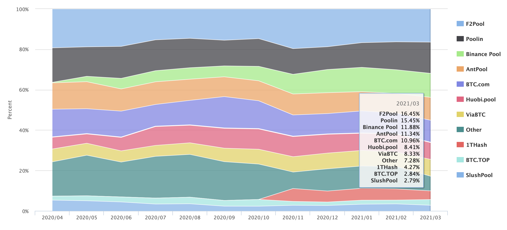

Property: Blog, Neo

从接触neo项目以来，其使用的dbft共识算法一直让我如鲠在喉，因为它看起来似乎是背离了区块链去中心化的初衷。它不再像比特币或者以太坊一样任何人都可以参与挖矿参与共识，相反的，是选定几个共识节点来进行共识，把生成区块的权力交给几个（动态）共识节点。所以我一直以来都在想方设法去找一个方式去解决这个中心化的问题，包括我的上一篇文章，也是在讲如何用可信执行环境来限制共识节点的权力。

但也正是因为在写上一篇文章的过程中，我仔细思考了下这种中心化给系统带来的那些影响，好像别的共识算法里也有类似的问题。于是在写完上一篇文章后，一个问题就一直回响在我脑海里，为什么？

这个为什么的问题其实包含的内容很广，包括为什么算力证明，又为什么dbft以及dbft2.0 。然后所有的问题又回归到一个问题上，那就是dbft真的比pow更加中心化么，或者说，我们真的能仅仅靠共识节点的数量来比较不同共识算法的去中心化程度么？

于是过去的几天里我又看了一遍北京大学肖臻老师的区块链课程，重新温习了一遍比特币和以太坊这两个系统。同时也跑去把neo文档里共识算法的部分从头到尾看了一遍，尤其是关于为什么要升级dbft2.0的部分。再结合我所了解的过去几年区块链领域发生的大事，我突然意识到虽然在设计上，pow是更加去中心化的一个系统（pos同理），但是在实际的运营中，dbft的系统其实是比pow更加去中心化的。

虽然比特币的pow共识系统允许任何人在任何时候接入比特币网络进行挖矿，但是由于算力和成本的原因，普通用户根本没有办法参与挖矿，而只有大户和矿池才有那样的财力来支持大规模的矿机部署。屈指可数的头部的矿场主掌握了比特币绝大多数算力。这样一来，所谓的去中心化在比特币系统里其实已经名存实亡了一大半。BCH的硬分叉就是一个例子，掌握了矿机的个人可以生生撕裂整个比特币社区。算力竞争原本是希望让系统更加去中心化，但是实际上却是使得算力越来越集中。已有的矿主因为币价波动而退出游戏，新矿主想要加入挖矿游戏的成本台阶越来越高，想象一下比特币有一天变成互联网企业一样赢者通吃。

下图就是最近比特币网路里矿工算力的分布图。可以看到，几大头部矿场几乎垄断了90%以上的算力，所谓的Others占到的比例只有区区7%。【数据源：[https://btc.com/stats/pool?percent_mode=latest#pool-history](https://btc.com/stats/pool?percent_mode=latest#pool-history)】

同样的中心化，在比特币生态里的闪电网络里也正在发生。原本设计为分布式的交易通道结构，却因为路由交易的存在而使得整个网络里出现了大型的hub节点，几乎所有的用户都是连接在少数几个hub上以方便路由交易。根据 [https://explorer.acinq.co/](https://explorer.acinq.co/) 的数据，闪电网络头部5%的节点掌握着90%以上的channel 连接。如果这些hub节点崩溃，那么整个闪电网络都将受到影响。

造成比特币愈加中心化问题的原因就恰恰就在于算力。更高的算力就有更高的收益，更高的收益可以带来更多的资金购买更高的算力。这样的模型里，大矿场算力多，就像是院子里的大树一样，树木越大，获取的阳光越多，阳光都被大树遮挡了，下面的小树苗就像小矿场，就没办法进行光合作用，没办法获得收益，没法生长，因而死去。于是院子里只剩下大树，再没有小树，挖矿的也只剩大矿场，小矿场纷纷消失。

比特币算力分布示意图。矿池之间相互竞争，大者恒大，弱者恒弱，参与共识的成本台阶越来越高。

dbft恰恰好解决了这个问题，就是给定名额参加共识。共识节点靠社区投票，也许不同节点的票的数量会有不同，但是当节点当选为共识节点之后，他们在参加共识的时候是完全相等的，并不会因为任何原因而有节点获得更多的优势。就好像是院子里的阳光被分成了等份，无论你这棵树有多大，你都只能享用自己的这份阳光，这样就可以保证别的树木的生长。所以在dbft的模型里，虽然设计上并没有pow来的去中心化，可是在真正运行的时候，却是保证系统不会中心化的最好机制。

dbft共识节点示意图。所有的共识节点产出新块的机会均等。共识节点数目不会因为相互竞争而越来越少。

以上。因为共识节点机会均等，所以neo N3不需要挖矿。