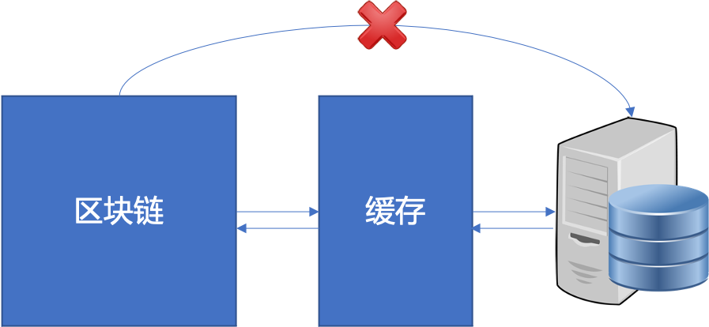
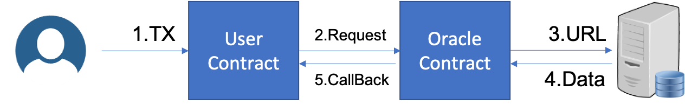

Property: Blog, Neo

续接上一篇预言机系统的文章 [Oracle预言机](https://jinghui.blog/202012/15/)

制约区块链发展的一个重要因素是落地，也就是把区块链这项用在现实生活中。为此我们就需要不停的去设想各种可能需要用到区块链的场景，比如游戏，比如发票，比如非同质化通证。可是这些场景依然很单薄，完全不能支持大家都区块链技术的期望，更无法发挥区块链技术的实力。就好像是现在的5G技术，空有一身本领，到头来大家只是用来做Speedtest。

但是为什么我们无法找到更多适合区块链的场景呢？因为区块链技术太封闭，为了安全，区块链只信任自己链上的数据，不接受链外的数据流，比如UTXO全是链上的交易构造的，比如neo legacy里的智能合约执行的时候只能通过少数接口获取链上的数据。所以想跟区块链打交道，那么你的场景里就不能有对外界信息的依赖。但是现实世界中大多数的场景都需要大量的信息交互，你打开手机，随便哪个应用不需要联网的。

比如订票软件，你需要实时的机票余票信息和价格信息。

比如交易软件，你需要物价信息。

比如快递软件，你需要最新的物流信息。

很无奈，这些都没办法用区块链去做。

因此为了拓宽区块链的应用场景，充分发挥区块链的潜力，可以给区块链投喂链外数据流的交互方式—预言机，应运而生。预言机就是一个可以把现实世界中的数据以交易的形式记录在区块链上的机制。熟悉计算机的小伙伴可以把预言机理解成一个现实世界和区块链之间的巨大cache。由于现实世界的数据在语义上与区块链是存在巨大的gap的，比如现实世界的数据可能实时变化，可能有多个数据源，可能需要复杂的计算或者转换，这些都无法在区块链共识的过程中解决，否则不同的共识节点在验证交易的时候可能获取到的数据都不同，但是如果共识节点不从现实世界直接取数据，而是从“cache”里取，那么就可以保证各个节点在验证交易时输入数据的一致性。因此需要在将数据写入区块链之前，有一个处理数据的过程，把数据处理成区块链可以接受的形式，比如把实时的数据取样出一个当前的固定的数据。



预言机的实现大致有三种，一种是中心化的第三方，第二种是可信的数据提供方，第三种则是去中心化的基于共识机制的预言机。在N3中则是因地制宜使用了拓展性更好的去中心化的预言机机制。

根据文档，N3是指定一些预言机节点来对交易的数据请求结果进行`共识`，以此来避免可能存在的预言机伪造数据问题。流程是，用户发起交易，在交易里触发智能合约里的预言机请求，这个请求的本质其实是调用N3内置的原生预言机合约里的request方法：

```csharp
/// <summary>
/// 创建 Oracle Request 请求数据
/// </summary>
/// <param name="url">访问资源路径,最大长度为 256 字节.</param>
/// <param name="filter">过滤器，用于在从数据源返回的结果中过滤出有用信息</param>
/// <param name="callback">回调函数方法名</param>
/// <param name="userData">用户自定义数据</param>
/// <param name="gasForResponse">回调函数执行预付款</param> 
void Request(string url, string filter, string callback, object userData, long gasForResponse);
```

原生合约会根据参数构建一个请求，然后预言机节点根据请求来获取数据，在预言机节点完成数据采集之后，会生成一个新的交易并在交易里调用用户合约里的回调函数。所以出发一次N3的预言机，将会有两笔交易被写入到区块链里，一笔是触发预言机，另一笔是回调。这样通过URL机制将数据源的选择权交给合约开发者或者数据调用者，今儿规避了预言机本身对数据源的信任问题，异步回调机制则是解决了智能合约调用预言机延迟过大的话可能会Block掉共识过程的问题。



按照这个逻辑，理论上如果我们要触发预言机，那么在调用预言机之后就应该会终止当前合约的执行，所以在一个合约方法里写在触发预言机语句之后的代码应该是不会执行的。不过这块由于一些环境配置问题，我还没办法做验证。

预言机虽然被定义为用来获取数据的工具，但是其实预言机也可以用来做一些比较迷的操作。因为调用预言机这个过程，实质上跟异步调用别的合约没有什么太大的区别，甚至N3里就是把预言机内置为一个原生合约。这就意味着，我们可以把预言机作为一个智能合约的外挂接口，把一些原本应该写入智能合约的逻辑写入在合约之外。比如计算量非常大的任务，我们就可以把任务通过预言机发到链外，然后在链外执行再返回结果。再比如一些我们想隐藏起来的逻辑，比如随机数生成算法，也可以通过预言机把这部分功能迁移到链外。

不过N3原生的预言机系统虽然很好很强大，但是依然有一些问题多多少少没有能够完美解决。

首先是N3的预言机作为分布式系统，其处理变化频率过快的数据比较麻烦。比如比特币的价格，基本上是实时变化的，因此不同的预言机节点在获取比特币价格的时候，很可能不同的节点获取到的价格就有零点零几的不同，从而导致预言机共识失败。虽然这个也可以通过用户优化数据格式在一定程度上解决。

其二是预言机系统是一个异步回调系统，再加上存在共识过程，因此其获取到的数据相较于触发交易来说存在较大的延迟，比如你当前看着机票的价格很低，然后立即发送一笔交易到链上，你的交易立即得到的了执行，这却并不意味着你能获取到的价格就是交易执行时的价格，毕竟预言机的回调交易并不是和你的触发交易同步发生的。

还有一个比价大的问题是数据源的可信程度，我们允许用户通过预言机将链外的数据引入到链内，这在相当大的程度上将链外的不可信因素引入到了区块链。以前的时候攻击区块链就只能攻击区块链节点本身，这个过程由共识协议来保护。可是当我们引入了预言机后，攻击区块链的方式就可以变得多样了，因为黑客可以通过攻击合约里指定的预言机数据源来将攻击的影响辐射到区块链里。此外，不可靠的合约开发者也可能通过预言机机制在智能合约里引入不可知的后门，毕竟通过预言机调用的部分功能并没有写入在区块链里，因此不可靠的开发者完全可以在神不知鬼不觉的情况下更改系统逻辑。

最后还有一个问题是数据的冗余。我在前文中提到预言机的功能类似于在区块链和数据源之间加了一层数据缓存以保证数据的可信。可是实际上这个`缓存`只是我抽象出来便于大家理解的，实际上N3的预言机在处理数据的时候并不会像缓存那样对数据进行保存以便于后续的请求。相反的，N3的预言机请求只跟用户发起的触发交易相关，用户发起了多少笔触发交易，就会有多少对应的预言机请求，即使在同一个区块内有许许多多的交易都在请求同一个数据，这样就难免导致预言机写入大量的冗余到区块链上。

以上。